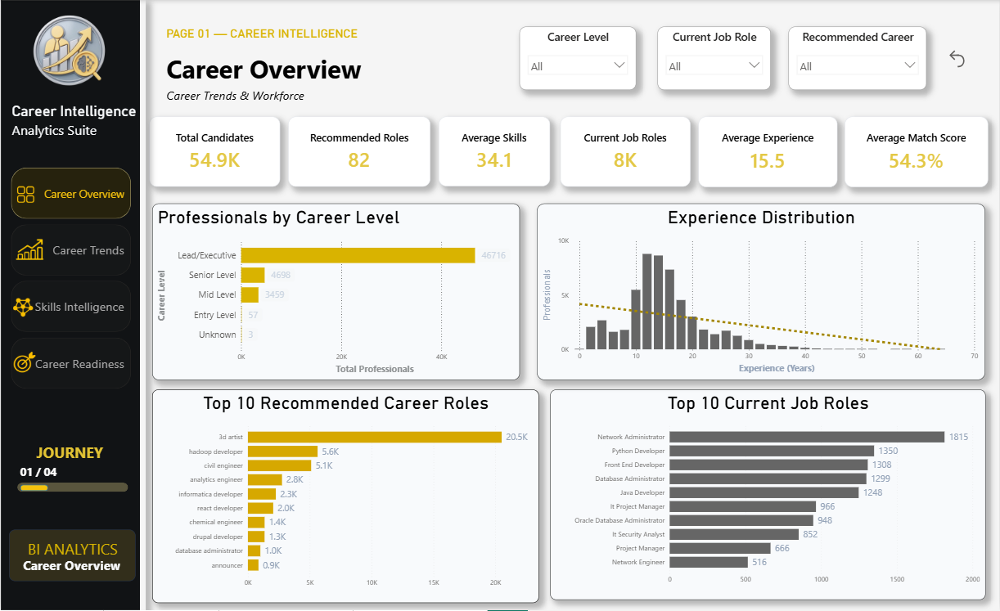
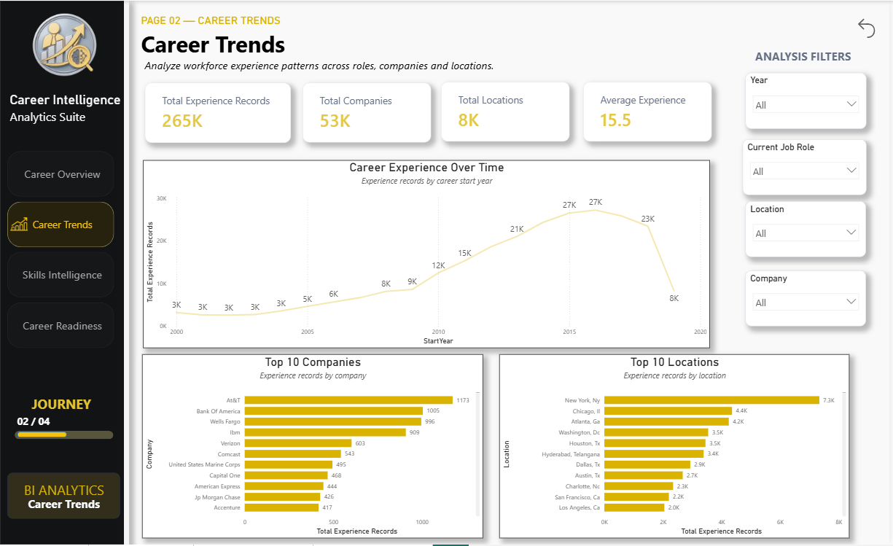
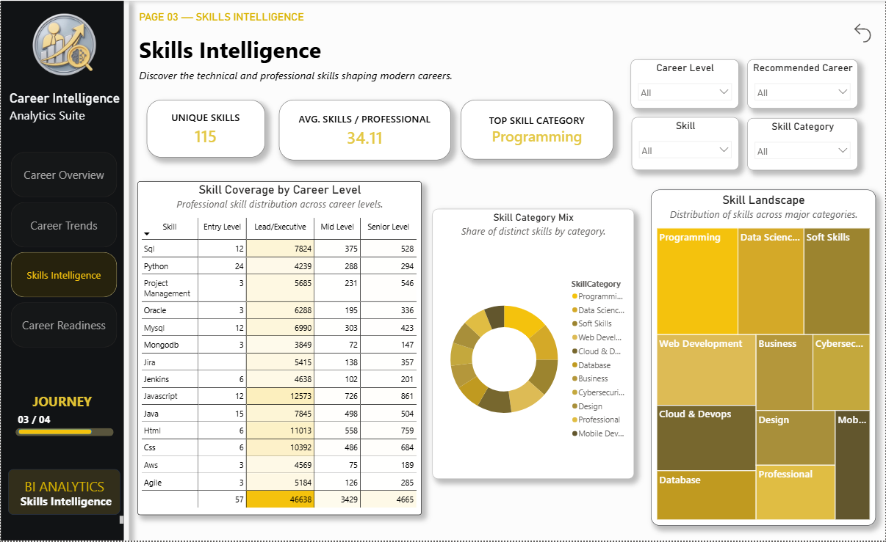
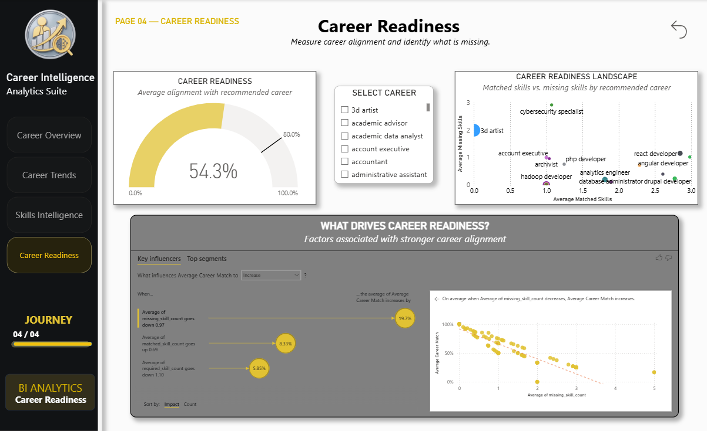
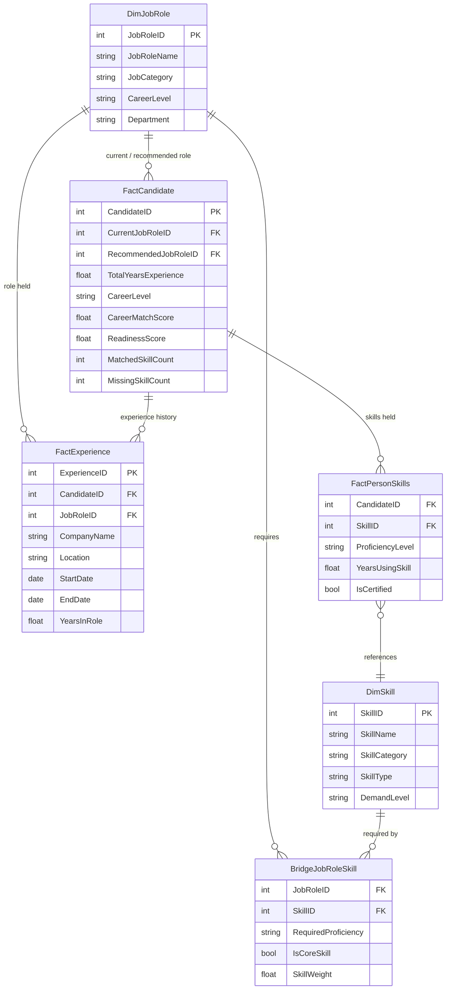

<h1 align="center">Career Intelligence</h1>

<p align="center">
  <strong>Workforce Analytics · Skills Intelligence · Career Readiness</strong>
</p>

<p align="center">
  An interactive Power BI analytics solution designed to uncover workforce patterns,
  career trends, skill landscapes, and career alignment.
</p>

<p align="center">
  
  
  
  
  
</p>

<p align="center">
  
</p>

---

## Dashboard Preview

<p align="center">
  
</p>

---

## Overview

**Career Intelligence** is a four-page Power BI analytics solution that transforms workforce and career data into a structured, interactive analytical experience.

The project follows a defined analytical journey:

```
Workforce  →  Career Trends  →  Skills  →  Career Readiness
```

Rather than treating job roles, skills, and experience as isolated data points, the dashboard connects these dimensions into a single, cohesive view of the career landscape — enabling deeper analysis of how workforce experience and skills translate into career alignment.

---

## Report Structure

| Page | Title | Focus |
|:---:|---|---|
| 01 | **Career Overview** | High-level snapshot of the workforce |
| 02 | **Career Trends** | Experience, companies, and locations |
| 03 | **Skills Intelligence** | Skill distribution and composition |
| 04 | **Career Readiness** | Career alignment and skill-gap analysis |

---

## 01 — Career Overview

<p align="center">
  
</p>

**What does the workforce look like?**

Provides a high-level snapshot of the professional landscape.

**Key metrics and analysis:**
- Total professionals
- Recommended career roles
- Average skills per professional
- Current job roles
- Average experience
- Average career match
- Career-level distribution
- Experience distribution
- Top recommended careers
- Top current roles

---

## 02 — Career Trends

<p align="center">
  
</p>

**Where and how is workforce experience distributed?**

Explores professional experience across time, organizations, and locations.

**Key analysis includes:**
- Experience records over time
- Company distribution
- Geographic distribution
- Average experience
- Current job-role analysis
- Interactive year filtering
- Company and location exploration

---

## 03 — Skills Intelligence

<p align="center">
  
</p>

**What skills define the workforce?**

Examines the structure and distribution of professional skills.

**Key analysis includes:**
- Unique skills
- Average skills per professional
- Top skill category
- Skill landscape
- Skill category composition
- Most represented skills
- Skill coverage across career levels
- Interactive skill filtering

**Visuals used:** Treemap · Doughnut Chart · Matrix · KPI Cards · Interactive Slicers

---

## 04 — Career Readiness

<p align="center">
  
</p>

**How closely do professionals align with recommended careers?**

The final stage of the dashboard moves from descriptive analysis toward career-readiness analysis.

**Key analysis includes:**
- Career readiness score
- Matched skills
- Missing skills
- Recommended career alignment
- Career readiness landscape
- Factors associated with career alignment

**Advanced analysis:** This page incorporates the **Key Influencers** visual to identify factors most strongly associated with stronger career alignment.

---

## Built With

<p align="left">
  
  
  
  
</p>

---

## Power BI Features Demonstrated

This project goes beyond basic charts and slicers, applying practices used in production-grade analytics solutions.

### Data Modeling
- Fact and dimension architecture
- Relationship modeling
- Bridge table implementation
- Cross-dimensional analysis

### DAX
- KPI measures
- Aggregations
- Average calculations
- Skill-gap calculations
- Career-match metrics
- Context-aware analytical measures

### Visualization
- KPI cards
- Clustered bar charts
- Line charts
- Treemap
- Doughnut chart
- Scatter / bubble chart
- Matrix
- Gauge
- Key Influencers

### Interactivity
- Page navigation
- Slicers
- Cross-filtering
- Drill interactions
- Bookmark-based interactions
- Reset-filter functionality
- Journey-style navigation

---

## Dataset

The model is built around **professionals (candidates)** as the core analytical subject, with their **work experience** and **skills** tracked as related, lower-grain records. Job roles and skills are modeled as shared reference (dimension) data so they can be reused consistently across the fact tables.

At a conceptual level, the source data answers three questions for each professional:

| Question | Answered by |
|---|---|
| Who are they, and how does their profile score against a target role? | `FactCandidate` |
| Where have they worked, and for how long? | `FactExperience` |
| What skills do they hold, and at what proficiency? | `FactPersonSkills` |
| What does a given job role require or represent? | `DimJobRole` |
| What does a given skill represent? | `DimSkill` |
| Which skills are associated with which roles? | `BridgeJobRoleSkill` |

> **Note:** Column names below reflect the structure implied by the report's measures and visuals (career match, readiness score, matched/missing skills, etc.). Update them to match your actual source-file column names if they differ — the model design and relationships will still hold.

**Grain of each table:**

- `FactCandidate` — one row per professional
- `FactExperience` — one row per work-experience record per professional (a professional can have many)
- `FactPersonSkills` — one row per skill held by a professional (a professional can have many)
- `DimJobRole` — one row per distinct job role
- `DimSkill` — one row per distinct skill
- `BridgeJobRoleSkill` — one row per skill-to-role mapping, resolving the many-to-many relationship between roles and skills

---

## Data Model

The project uses a **star-schema** design: a central fact table (`FactCandidate`) surrounded by supporting fact and dimension tables, with a bridge table resolving the many-to-many relationship between job roles and skills.



**Table roles:**

| Table | Type | Grain | Description |
|---|---|---|---|
| `FactCandidate` | Fact | 1 row per professional | Core professional-level record: current and recommended role, experience, career level, and career-match / readiness scores |
| `FactExperience` | Fact | 1 row per work record | Historical work experience — company, location, role, and duration |
| `FactPersonSkills` | Fact | 1 row per candidate-skill pair | Skills held by each professional, with proficiency and tenure |
| `DimJobRole` | Dimension | 1 row per job role | Reference data describing each job role and its category/level |
| `DimSkill` | Dimension | 1 row per skill | Reference data describing each skill and its category |
| `BridgeJobRoleSkill` | Bridge | 1 row per role-skill pair | Maps which skills are associated with, or required by, each job role |

**Key relationships:**
- `DimJobRole` → `FactCandidate` (current role and recommended role) — one-to-many
- `DimJobRole` → `FactExperience` — one-to-many
- `FactCandidate` → `FactPersonSkills` — one-to-many
- `FactPersonSkills` → `DimSkill` — many-to-one
- `DimJobRole` ↔ `DimSkill` via `BridgeJobRoleSkill` — many-to-many

This structure allows the report to calculate skill-gap and career-match measures by comparing a candidate's actual skills (`FactPersonSkills`) against the skills expected for their recommended role (`BridgeJobRoleSkill`), while still supporting independent analysis of experience trends and skill distribution.

---

## Project Structure

```text
Career-Intelligence/
├── Assets/                    # Logos and branding assets
├── Screenshots/                # Dashboard page previews
├── CareerIntelligence.pbix     # Power BI report file
└── README.md
```

---

## Getting Started

1. Clone or download this repository.
2. Open `CareerIntelligence.pbix` in **Power BI Desktop**.
3. Refresh the data model if prompted.
4. Explore the report using the page navigation and slicers.

---

## License

This project is licensed under the [MIT License](LICENSE).
